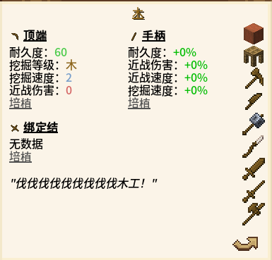

# 木

<figure><figcaption></figcaption></figure>

_<mark style="color:orange;">**培植：工具在修复时,单位材料能提供更多耐久度。**</mark>_

<figure><figcaption></figcaption></figure>

<figure><figcaption></figcaption></figure>
